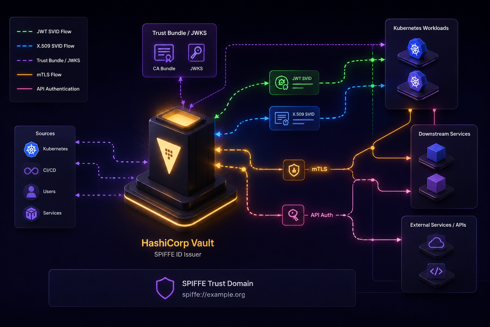

# SPIFFE with HashiCorp Vault

This repository contains a runnable local HashiBank demo that shows how **HashiCorp Vault** implements SPIFFE. The lab runs on a single Vault Enterprise cluster and includes an optional SPIRE overlay for integration testing.

For a presenter-oriented talk track, use [demo/DEMO_WALKTHROUGH.md](./demo/DEMO_WALKTHROUGH.md).

## The demo includes the following scenarios

1. **Payments API X.509**
   - AppRole login to the HashiBank Vault cluster
   - PKI-issued certificate with `spiffe://hashibank.demo/payments/api`
   - SPIFFE X.509 auth on the same cluster
   - Read of payments API KV secrets
1. **Fraud Ops JWT**
   - AppRole login with alias metadata
   - SPIFFE JWT-SVID minted from the same cluster
   - SPIFFE JWT auth on the same cluster
   - Dynamic Postgres credentials from Vault
   - Query of `fraud_alerts` and reveal in the fraud dashboard
1. **Relationship assistant OIDC**
   - AppRole login
   - SPIFFE JWT-SVID minting
   - Discovery and JWKS retrieval from the SPIFFE engine
   - Downstream validation with OIDC-style patterns
   - Reveal of masked banker context
1. **SPIRE JWT-SVID to Vault auth** *(optional)*
   - SPIRE agent fetch of a JWT-SVID for `spiffe://spire.hashibank.demo/workloads/vault-spire-client`
   - Vault SPIFFE JWT auth configured from the SPIRE federation bundle
   - KV read proving the returned Vault token is policy-scoped
1. **Vault as SPIRE upstream authority** *(optional)*
   - Vault PKI root exposed at `spire-pki/`
   - SPIRE server configured with `upstreamauthority_vault`
   - SPIRE workload SVID chain validated back to the Vault-managed root

## Demo architecture


## Repository layout

| Path | Purpose |
| --- | --- |
| `README.md` | Repository overview, setup, and operator runbook |
| `demo/DEMO_WALKTHROUGH.md` | Live-demo talk track and highlight cues |
| `demo/` | Docker Compose lab, bootstrap scripts, Python scenario runners, and web apps |

## Prerequisites

- Docker Desktop or Docker Engine with Compose v2
- A Vault Enterprise license file at `license.hclic` in the repository root

Run the following commands from `demo/` unless noted otherwise.

## Default images and ports

The Compose file defaults to:

```text
hashicorp/vault-enterprise:2.0.0-ent
```

Override the image with:

```bash
export VAULT_ENTERPRISE_IMAGE=hashicorp/vault-enterprise:2.0-ent
```

Default host ports:

```text
hashibank-vault  -> https://localhost:18200
fraud web        -> http://localhost:18081
assistant web    -> http://localhost:18082
perf replica     -> https://localhost:19200 (optional workflow)
spire bundle     -> https://localhost:18443 (optional SPIRE overlay)
```

Override the host ports with:

```bash
export HASHIBANK_VAULT_HOST_PORT=18200
export HASHIBANK_VAULT_PERF_HOST_PORT=19200
export HASHIBANK_FRAUD_WEB_PORT=18081
export HASHIBANK_ASSISTANT_WEB_PORT=18082
```

## Bootstrapping

Bootstrap the base demo:

```bash
cd demo
./scripts/bootstrap.sh
```

That script:

1. Generates local TLS assets under `demo/config/tls/`
1. Starts `hashibank-vault`, `postgres-hashibank`, and `demo-tools`
1. Initializes and unseals the Vault cluster
1. Configures AppRole, PKI, SPIFFE, KV, database secrets, policies, and demo personas
1. Starts the two web apps

Review the configured environment before the live scenarios:

```bash
./scripts/bootstrap.sh review
```

The review output is split into logical sections and pauses until you press `n`. It shows:

- Policies
- AppRole definitions and alias metadata
- PKI role configuration
- SPIFFE engine configuration and SPIFFE roles
- SPIFFE auth configuration and SPIFFE auth roles
- Payments API KV secrets

## Bootstrapping the SPIRE extension

Bootstrap the optional SPIRE overlay:

```bash
./scripts/bootstrap-spire.sh
```

This opt-in script:

1. Reuses the base `./scripts/bootstrap.sh` environment
1. Starts `spire-server`, `spire-agent`, and `hashibank-spire-client`
1. Configures Vault PKI and AppRole resources for SPIRE `upstreamauthority_vault`
1. Publishes a SPIRE federation bundle endpoint on `https://localhost:18443`
1. Configures `auth/spire-jwt/` in Vault to trust the SPIRE federation bundle
1. Registers the `vault-spire-client` workload and verifies that it can fetch SPIRE SVIDs

Current boundary:

- The intended **SPIRE X.509-SVID to Vault SPIFFE auth** path is not enabled in the shipped overlay.
- Vault still authenticated the SPIRE-issued X.509-SVID only when the SPIFFE auth mount trusted the SPIRE issuing intermediate directly, not the SPIRE federation bundle or root.
- That workaround is intentionally omitted because it diverges from the intended bundle-fetch model and is awkward for rotation.

## Running the demo flows

Each demo script supports:

- No argument to run the full scenario with pauses at each checkpoint
- `status` to show the current checkpoint status
- `reset` to clear the saved checkpoint state

Each scenario script runs the checkpoints in order and pauses between them until you press `n`. Every checkpoint prints:

- The Vault CLI or local inspection command being run
- The raw response or file content
- Decoded JWT claims where relevant

### Payments API X.509

```bash
./scripts/demo-x509-payments.sh
```

This flow runs through AppRole login, PKI issuance, SPIFFE X.509 auth, and the KV read. It shows:

- The AppRole login response with `client_token` and metadata
- The PKI role definition and certificate issuance response
- The raw `payments-api.crt` PEM and `openssl x509 -text` output
- The SPIFFE X.509 auth role definition
- The payments API KV secrets read

### Fraud Ops JWT and database credentials

```bash
./scripts/demo-jwt-fraud.sh
```

This flow runs through AppRole login, JWT minting, SPIFFE JWT auth, database credential retrieval, and the final page reveal. It shows:

- AppRole alias metadata
- The raw minted JWT-SVID
- The SPIFFE JWT auth role definition and login response
- The dynamic database credentials response
- The SQL-backed business outcome before the page reveal

Browser reveal:

```text
http://localhost:18081/
```

The page renders from prepared checkpoint state. It does not rerun Vault login or the SQL query on page load.

### Relationship assistant OIDC validation

```bash
./scripts/demo-agentic-oidc.sh
```

This flow runs through AppRole login, JWT minting, discovery and JWKS retrieval, JWT validation, and the final page reveal. It shows:

- AppRole alias metadata
- The raw minted JWT-SVID
- The discovery document and JWKS output
- The validated claims from the downstream JWT verification step

Browser reveal:

```text
http://localhost:18082/
```

The page renders from prepared checkpoint state. It does not mint or validate a JWT on page load.

### SPIRE JWT-SVID to Vault SPIFFE auth

```bash
./scripts/demo-spire-jwt.sh
```

Run this after `./scripts/bootstrap-spire.sh`.

This flow shows:

- The raw SPIRE agent `fetch jwt` response for the `vault-spire-client` workload
- Decoded JWT claims for `spiffe://spire.hashibank.demo/workloads/vault-spire-client`
- Vault `auth/spire-jwt/config` and `auth/spire-jwt/role/vault-spire-client`
- A successful Vault login using `Authorization: Bearer <jwt-svid>`
- A KV read at `kv/spire/demo`

This is the supported SPIRE-to-Vault auth path in the local demo because it matches the documented SPIRE federation-bundle and Vault SPIFFE JWT auth model.

### Vault as SPIRE upstream authority

```bash
./scripts/demo-spire-upstreamauthority.sh
```

Run this after `./scripts/bootstrap-spire.sh`.

This flow shows:

- The Vault `spire-pki/cert/ca` root certificate used by the SPIRE upstream authority plugin
- A SPIRE-issued X.509-SVID fetched from the Workload API
- The issuing intermediate in the SPIRE workload chain
- `openssl verify` proving that the workload SVID chains back to the Vault-managed root certificate

This proves the supported **Vault to SPIRE upstream authority** integration for X.509 CA delegation. It is intentionally not presented as JWT key publication because `upstreamauthority_vault` does not publish JWT signing keys.

## SPIFFE engine behaviour on performance replica

To test how the SPIFFE secrets engine behaves on a performance replica when `jwt_issuer_url` is omitted from the mount configuration, run:

```bash
./scripts/perf-repl-spiffe-issuer.sh
```

This opt-in workflow:

1. Reuses the demo primary cluster `hashibank-vault` and bootstraps it first if needed
1. Starts a performance replica cluster as `hashibank-vault-perf`
1. Enables performance replication from `hashibank-vault` to the replica
1. Enables a new SPIFFE mount on the primary at `spiffe-default-issuer/` without `jwt_issuer_url`
1. Authenticates to the replica through a replicated AppRole
1. Mints a JWT-SVID from the replica and decodes its `iss` claim

The script prints:

- The replicated SPIFFE mount config read from both clusters
- The OIDC discovery documents for the new mount on both clusters
- The observed `iss` value from the JWT minted on the performance replica
- Whether that `iss` matches the primary cluster API address or the replica cluster API address

Artifacts will be saved at:

- `demo/runtime/generated/perf-repl-spiffe-issuer-result.json`
- `demo/runtime/generated/perf-repl-spiffe-issuer.jwt`

To reprint the captured evidence without rerunning the workflow:

```bash
./scripts/perf-repl-spiffe-issuer.sh status
```

## Runtime artifacts

Bootstrap writes ephemeral material under `demo/runtime/`, including:

- Vault init output and the root token
- Generated AppRole role IDs and secret IDs
- Checkpoint state under `demo/runtime/checkpoints/`
- Rendered SPIFFE template files
- The generated payments certificate and key
- The performance replica issuer experiment JSON result and raw JWT when that workflow runs
- SPIRE runtime state, join token, bootstrap bundle, and generated SVID inspection files when the SPIRE overlay runs

`demo/runtime/` is git-ignored and removed by `./scripts/teardown.sh`. Generated TLS files under `demo/config/tls/` are also disposable local artifacts.

## Demo notes

- The X.509 flow uses **Vault PKI** with a SPIFFE URI SAN. It does not claim native X.509 SVID issuance from the SPIFFE secrets engine.
- The JWT flow uses **Vault SPIFFE secrets** for JWT-SVID minting and **Vault SPIFFE auth** for login on the same cluster.
- The assistant flow validates the Vault-minted JWT through discovery and JWKS rather than Vault-native auth.
- The SPIRE setup uses a separate trust domain, `spire.hashibank.demo`, so Vault-native and SPIRE-issued identities do not publish conflicting trust bundles for the same domain.
- The supported SPIRE-to-Vault auth path in this repo is **JWT-SVID to `auth/spire-jwt/`**.
- The repo does not ship a SPIRE X.509-SVID-to-Vault auth demo because the clean bundle and root trust model did not authenticate successfully in this lab.
- The only working X.509 workaround we found was to trust the SPIRE issuing intermediate directly, which we intentionally do not ship.

## Tear down

```bash
./scripts/teardown.sh
```

## Troubleshooting

- If a local port is already in use, override the host port environment variables before bootstrapping.
- If the pinned Enterprise image tag does not start with your license, set `VAULT_ENTERPRISE_IMAGE` to another compatible Enterprise 2.0 tag and rerun bootstrap.
- If a SPIRE demo script reports that the overlay is not bootstrapped, run `./scripts/bootstrap-spire.sh` first.

## Resources

These links map directly to the features used in the demo:

- [Vault documentation](https://developer.hashicorp.com/vault/docs)
- [Vault Enterprise documentation](https://developer.hashicorp.com/vault/docs/enterprise)
- [AppRole auth method](https://developer.hashicorp.com/vault/docs/auth/approle)
- [PKI secrets engine](https://developer.hashicorp.com/vault/docs/secrets/pki)
- [SPIFFE auth method](https://developer.hashicorp.com/vault/docs/auth/spiffe)
- [SPIFFE secrets engine](https://developer.hashicorp.com/vault/docs/secrets/spiffe)
- [Database secrets engine](https://developer.hashicorp.com/vault/docs/secrets/databases)
- [What is SPIFFE](https://spiffe.io/docs/latest/spiffe-about/overview/)
- [Demo code on GitHub](https://github.com/DarthVaderRC/vault-spiffe)
