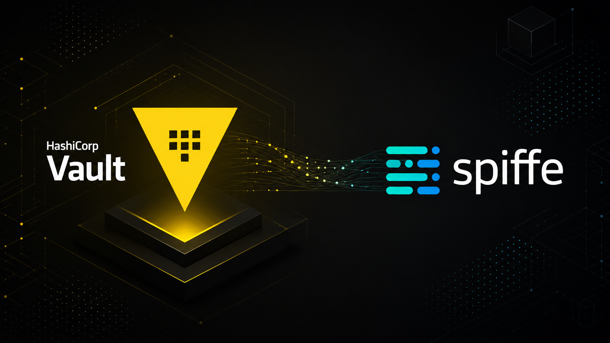
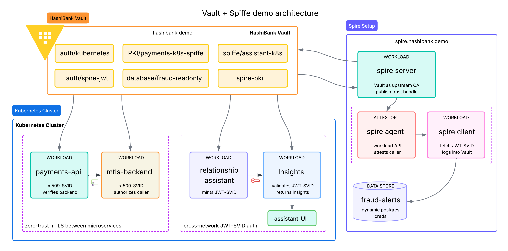
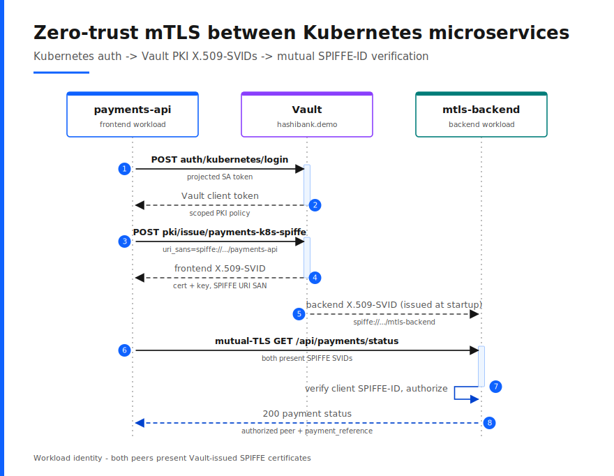
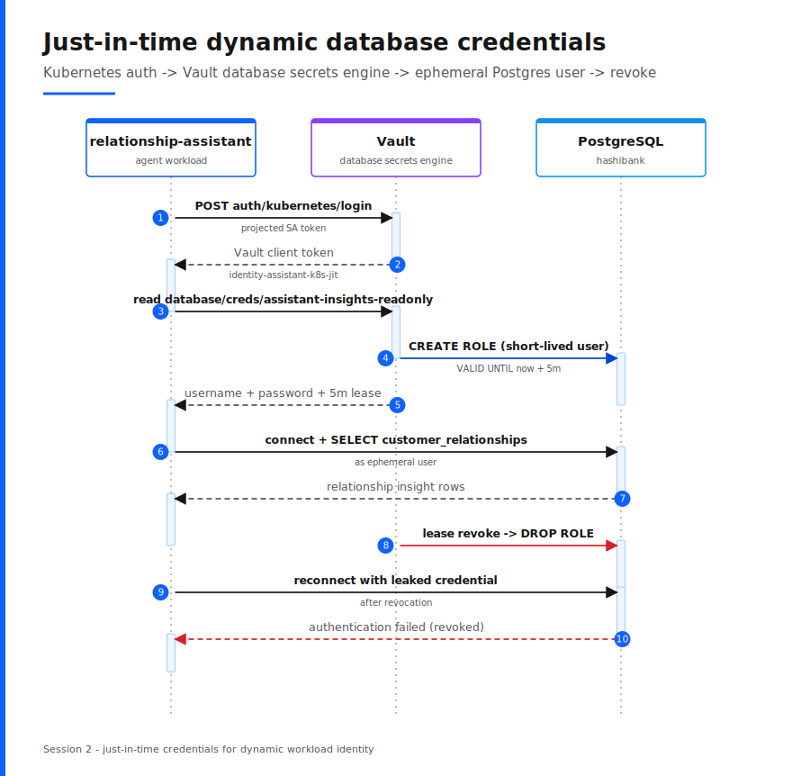
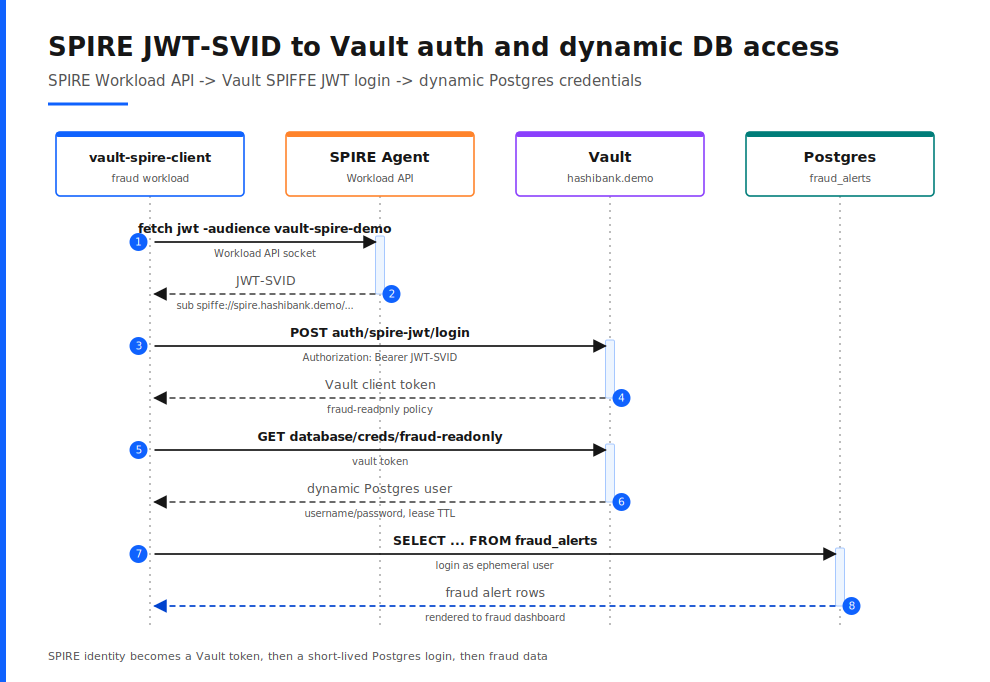
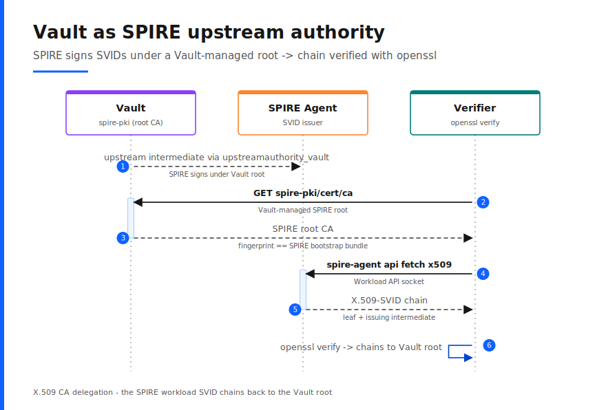
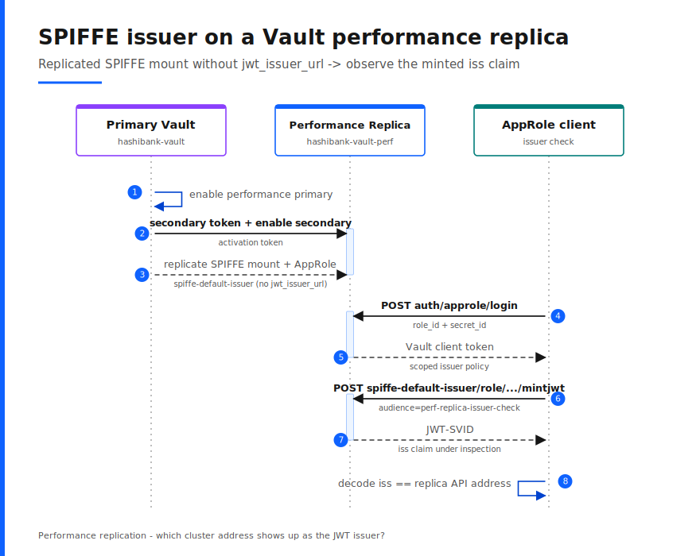

# SPIFFE with HashiCorp Vault Demo

This repository contains a runnable local HashiBank demo that shows how **HashiCorp Vault** can act as a control plane for SPIFFE-aligned workload identity. The recommended path pairs a single Vault Enterprise cluster in Docker Compose with a local `kind` overlay for Kubernetes-authenticated workloads, plus an optional SPIRE overlay for integration testing. The lab requires **Vault Enterprise** because the SPIFFE auth and SPIFFE secrets engine features used here are Enterprise features.

For a presenter-oriented talk track, use [demo/DEMO_WALKTHROUGH.md](./demo/DEMO_WALKTHROUGH.md).

For a GitHub Pages-ready architecture guide, open [docs/index.html](./docs/index.html).

## The demo includes the following scenarios

> **Note:** The first two sub-use cases use different identity artifacts on purpose. The Kubernetes mTLS path uses a PKI-issued X.509 certificate with a SPIFFE URI SAN because the destination protocol is mTLS. The Kubernetes JWT path uses a Vault-minted JWT-SVID because the destination is a downstream verifier using discovery and JWKS. This is protocol fit in the demo, not a blanket recommendation that every workload should prefer one over the other.

1. **Vault-native workload identity patterns** *(recommended path)*
   - Local `kind` cluster with real service account tokens
   - Vault `auth/kubernetes` as the initial trust source
   - **Sub-use case A1:** Kubernetes auth -> Vault-issued X.509 identities for `payments-api` and `mtls-backend` -> zero-trust mTLS -> payment settlement status
   - **Sub-use case A2:** Kubernetes auth -> JWT-SVID minting with business metadata -> discovery and JWKS retrieval -> claim-authorized relationship insights API -> next-best action
1. **SPIRE JWT-SVID to Vault auth and DB brokering** *(optional)*
   - SPIRE agent fetch of a JWT-SVID for `spiffe://spire.hashibank.demo/workloads/vault-spire-client`
   - Vault SPIFFE JWT auth configured from the SPIRE federation bundle
   - Dynamic Postgres credentials and a fraud-alerts query proving the returned Vault token is policy-scoped
1. **Vault as SPIRE upstream authority** *(optional)*
   - Vault PKI root exposed at `spire-pki/`
   - SPIRE server configured with `upstreamauthority_vault`
   - SPIRE workload SVID chain validated back to the Vault-managed root

An obvious follow-on pattern is exchanging a Vault-minted JWT-SVID for cloud credentials through web identity federation, but this repository keeps that as a deferred extension instead of pretending the local lab implements it today.

## Demo architecture


*Anchor visual of the recommended kind-based demo architecture*

## Repository layout

| Path | Purpose |
| --- | --- |
| `README.md` | Repository overview, setup, and operator runbook |
| `docs/` | GitHub Pages-ready architecture site, living spec, and local publishing notes |
| `demo/DEMO_WALKTHROUGH.md` | Live-demo talk track and highlight cues |
| `demo/` | Docker Compose lab, kind overlay assets, bootstrap scripts, Python scenario runners, and demo apps |

## Prerequisites

- Docker Desktop or Docker Engine with Compose v2
- `kubectl`
- `kind`
- A Vault Enterprise license file at `license.hclic` in the repository root

Run the following commands from `demo/` unless noted otherwise.

## Default images and ports

The Compose file defaults to:

```text
hashicorp/vault-enterprise:2.0.0-ent
```

Override the image with:

```bash
export VAULT_ENTERPRISE_IMAGE=hashicorp/vault-enterprise:2.0-ent
```

Default host ports:

```text
hashibank-vault  -> https://localhost:18200
kind API         -> https://127.0.0.1:16443
perf replica     -> https://localhost:19200 (optional workflow)
spire bundle     -> https://localhost:18443 (optional SPIRE overlay)
```

Override the host ports with:

```bash
export HASHIBANK_VAULT_HOST_PORT=18200
export HASHIBANK_VAULT_PERF_HOST_PORT=19200
export SPIRE_BUNDLE_ENDPOINT_HOST_PORT=18443
```

## Bootstrapping

Bootstrap the recommended demo path:

```bash
cd demo
./scripts/bootstrap.sh
```

That script:

1. Starts the HashiBank Vault cluster and demo tools
1. Regenerates Vault TLS assets so the cluster is reachable from pods through `host.docker.internal`
1. Configures the base Vault PKI, SPIFFE, and trust-bundle state for the Kubernetes-native flows
1. Creates a local `kind` cluster on a fixed API port
1. Configures Vault `auth/kubernetes` against that cluster
1. Builds and loads the local workload images into `kind`
1. Creates workload pods, downstream consumers, and the trust assets they need
1. Verifies that pods can reach Vault and that the new consumers are ready

The local lab deliberately separates the **public issuer** from the **pod reachability path**:

- `https://vault.demo.internal:18200` is the canonical Vault and OIDC issuer URL
- `host.docker.internal` is the bridge address pods use to reach the host-side Vault cluster

Review the configured environment before the live scenarios:

```bash
./scripts/bootstrap.sh review
```

The review output is split into logical sections and pauses until you press `n`. It shows:

- SPIFFE engine configuration
- Vault Kubernetes auth configuration and bound roles
- PKI and SPIFFE issuer roles used by the Kubernetes workloads
- demo namespace service accounts, pods, and services

## Bootstrapping the SPIRE extension

Bootstrap the optional SPIRE overlay:

```bash
./scripts/bootstrap.sh spire
```

This opt-in command:

1. Reuses the base Vault and kind environment from `./scripts/bootstrap.sh`
1. Starts `spire-server`, `spire-agent`, and `hashibank-spire-client`
1. Configures Vault PKI and a dedicated Vault token for SPIRE `upstreamauthority_vault`
1. Starts Postgres and configures Vault Database secrets for short-lived fraud-readonly access
1. Publishes a SPIRE federation bundle endpoint on `https://localhost:18443`
1. Configures `auth/spire-jwt/` in Vault to trust the SPIRE federation bundle
1. Registers the `vault-spire-client` workload and verifies that it can fetch SPIRE SVIDs

To reprint the SPIRE overlay status without rerunning setup:

```bash
./scripts/bootstrap.sh spire-status
```

Current boundary:

- The intended **SPIRE X.509-SVID to Vault SPIFFE auth** path is not enabled.
- Vault still authenticated the SPIRE-issued X.509-SVID only when the SPIFFE auth mount trusted the SPIRE issuing intermediate directly, not the SPIRE federation bundle or root.
- That workaround is intentionally omitted because it diverges from the intended bundle-fetch model and is awkward for rotation.

## Running the demo flows

Each demo script supports:

- No argument to run the full scenario, pausing after every call
- `status` to show the current checkpoint status
- `reset` to clear the saved checkpoint state

Each scenario script runs the checkpoints in order and pauses after every call until you press `Enter`, so each request and response stays on screen. Every call prints:

- The Vault CLI or local inspection command being run
- The raw response or file content
- Decoded JWT claims where relevant

### Zero-trust mTLS between Kubernetes microservices

```bash
./scripts/demo-k8s-mtls.sh
```



This flow runs through Kubernetes auth, dual PKI issuance, backend certificate inspection, and an in-cluster zero-trust mTLS call. It shows:

- The bound Kubernetes auth role for the `payments-api` service account
- The matching Kubernetes auth role and PKI role for `mtls-backend`
- The login response from `auth/kubernetes/login` for the caller workload
- The PKI role definitions and certificate issuance responses for both sides of the mTLS exchange
- The raw `openssl x509 -text` output for the backend certificate, including the SPIFFE URI SAN
- The payment status response proving that `payments-api` verified the backend SPIFFE ID and `mtls-backend` authorized the client SPIFFE ID

### Cross-network API authentication using JWT-SVID

```bash
./scripts/demo-k8s-jwt.sh
```


This flow runs through Kubernetes auth, JWT minting, discovery and JWKS retrieval, and a protected call to the relationship insights API. It shows:

- The bound Kubernetes auth role for the `relationship-assistant` service account
- The login response from `auth/kubernetes/login`
- The raw minted JWT-SVID, including business claims such as `bank`, `application`, `line_of_business`, and `customer_data_domain`
- The discovery document and JWKS output
- The validated claims and authorization outcome returned by `jwt-consumer`
- The masked relationship insights and next-best action rendered at `http://localhost:18082/`
- The public issuer value (`vault.demo.internal`) and the local host-bridge reachability pattern used by the lab

### Just-in-time dynamic database credentials

```bash
./scripts/demo-k8s-jit.sh
```



This flow reuses the same Kubernetes-verified `relationship-assistant` identity
and brokers a short-lived Postgres credential from Vault's database secrets
engine. It shows:

- The Kubernetes auth login that returns a token carrying the
  `identity-assistant-k8s-jit` policy
- A brand-new dynamic Postgres user minted on demand from
  `database/creds/assistant-insights-readonly` with a 5-minute lease
- A read-only query against the `customer_relationships` table running as that
  ephemeral user
- Lease revocation that immediately makes the credential stop working, proving
  just-in-time, revocable access

### SPIRE JWT-SVID to Vault auth and dynamic DB access

```bash
./scripts/demo-spire-jwt.sh
```

Run this after `./scripts/bootstrap.sh spire`.



This flow shows:

- The raw SPIRE agent `fetch jwt` response for the `vault-spire-client` workload
- Decoded JWT claims for `spiffe://spire.hashibank.demo/workloads/vault-spire-client`
- Vault `auth/spire-jwt/config` and `auth/spire-jwt/role/vault-spire-client`
- A successful Vault login using `Authorization: Bearer <jwt-svid>`
- A read of `database/creds/fraud-readonly`
- The resulting Postgres query against `fraud_alerts`
- The prepared `hashibank-fraud-web` page that renders the queried rows

This is the supported SPIRE-to-Vault auth path in the local demo because it matches the documented SPIRE federation-bundle and Vault SPIFFE JWT auth model.

### Vault as SPIRE upstream authority

```bash
./scripts/demo-spire-upstreamauthority.sh
```

Run this after `./scripts/bootstrap.sh spire`.



This flow shows:

- The Vault `spire-pki/cert/ca` root certificate used by the SPIRE upstream authority plugin
- A SPIRE-issued X.509-SVID fetched from the Workload API
- The issuing intermediate in the SPIRE workload chain
- `openssl verify` proving that the workload SVID chains back to the Vault-managed root certificate

This proves the supported **Vault to SPIRE upstream authority** integration for X.509 CA delegation. It is intentionally not presented as JWT key publication because `upstreamauthority_vault` does not publish JWT signing keys.

## SPIFFE engine behaviour on performance replica

To test how the SPIFFE secrets engine behaves on a performance replica when `jwt_issuer_url` is omitted from the mount configuration, run:

```bash
./scripts/perf-repl-spiffe-issuer.sh
```



This opt-in workflow:

1. Reuses the demo primary cluster `hashibank-vault` and bootstraps it first if needed
1. Starts a performance replica cluster as `hashibank-vault-perf`
1. Enables performance replication from `hashibank-vault` to the replica
1. Enables a new SPIFFE mount on the primary at `spiffe-default-issuer/` without `jwt_issuer_url`
1. Authenticates to the replica through a replicated AppRole
1. Mints a JWT-SVID from the replica and decodes its `iss` claim

The script prints:

- The replicated SPIFFE mount config read from both clusters
- The OIDC discovery documents for the new mount on both clusters
- The observed `iss` value from the JWT minted on the performance replica
- Whether that `iss` matches the primary cluster API address or the replica cluster API address

Artifacts will be saved at:

- `demo/runtime/generated/perf-repl-spiffe-issuer-result.json`
- `demo/runtime/generated/perf-repl-spiffe-issuer.jwt`

To reprint the captured evidence without rerunning the workflow:

```bash
./scripts/perf-repl-spiffe-issuer.sh status
```

## Runtime artifacts

Bootstrap writes ephemeral material under `demo/runtime/`, including:

- Vault init output and the root token
- Checkpoint state under `demo/runtime/checkpoints/`
- kind kubeconfig and Kubernetes reviewer-token material
- Rendered SPIFFE template files
- The generated payments certificate and key
- The performance replica issuer experiment JSON result and raw JWT when that workflow runs
- SPIRE runtime state, join token, bootstrap bundle, Vault upstream token, and generated SVID inspection files when the SPIRE overlay runs

`demo/runtime/` is git-ignored and removed by `./scripts/teardown.sh`. Generated TLS files under `demo/config/tls/` are also disposable local artifacts.

## Demo notes

- The X.509 flow uses **Vault PKI** with SPIFFE URI SANs on both sides of the service-to-service exchange. It does not claim native X.509 SVID issuance from the SPIFFE secrets engine.
- The zero-trust mTLS proof is a payment-status response after explicit SPIFFE ID verification on both peers, not another Vault login.
- The JWT flow uses **Vault SPIFFE secrets** for JWT-SVID minting and downstream validation through discovery and JWKS.
- The downstream JWT consumer validates the Vault-minted JWT locally, authorizes business claims, and returns masked relationship insights plus a next-best action.
- The SPIRE setup uses a separate trust domain, `spire.hashibank.demo`, so Vault-native and SPIRE-issued identities do not publish conflicting trust bundles for the same domain.
- The supported SPIRE-to-Vault auth path in this repo is **JWT-SVID to `auth/spire-jwt/`**.
- The repo does not ship a SPIRE X.509-SVID-to-Vault auth demo because the clean bundle and root trust model did not authenticate successfully in this lab.
- The only working X.509 workaround we found was to trust the SPIRE issuing intermediate directly, which we intentionally do not ship.

## Tear down

```bash
./scripts/teardown.sh
```

## Troubleshooting

- If a local port is already in use, override the host port environment variables before bootstrapping.
- If the pinned Enterprise image tag does not start with your license, set `VAULT_ENTERPRISE_IMAGE` to another compatible Enterprise 2.0 tag and rerun bootstrap.
- If a SPIRE demo script reports that the overlay is not bootstrapped, run `./scripts/bootstrap.sh spire` first.

## Resources

These links map directly to the features used in the demo:

- [Vault documentation](https://developer.hashicorp.com/vault/docs)
- [Vault Enterprise documentation](https://developer.hashicorp.com/vault/docs/enterprise)
- [PKI secrets engine](https://developer.hashicorp.com/vault/docs/secrets/pki)
- [SPIFFE auth method](https://developer.hashicorp.com/vault/docs/auth/spiffe)
- [SPIFFE secrets engine](https://developer.hashicorp.com/vault/docs/secrets/spiffe)
- [Kubernetes auth method](https://developer.hashicorp.com/vault/docs/auth/kubernetes)
- [What is SPIFFE](https://spiffe.io/docs/latest/spiffe-about/overview/)
- [Demo code on GitHub](https://github.com/DarthVaderRC/vault-spiffe)
