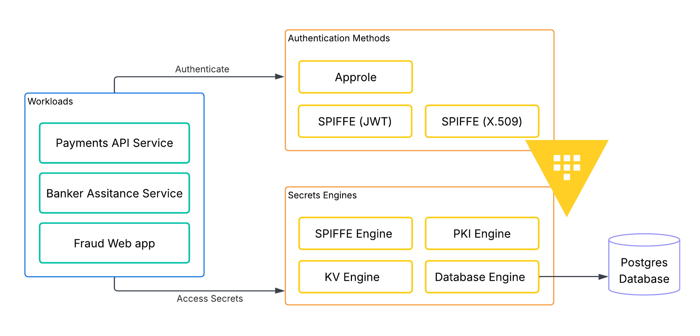

# HashiBank Vault SPIFFE demo

This demo runs on a single **HashiBank Vault Cluster** backed by Vault Enterprise 2.0, plus an optional SPIRE overlay for integration testing. The base cluster hosts:

- AppRole for machine authentication
- PKI for X.509 issuance
- SPIFFE secrets engine for JWT-SVID minting
- SPIFFE auth mounts for X.509 and JWT login
- KV and database secrets for the business outcomes

Supporting services in the lab:

- **`postgres-hashibank`** with seeded `fraud_alerts` data
- **`hashibank-fraud-web`** for the fraud analyst page reveal
- **`hashibank-assistant`** for the banker assistant page reveal
- **`demo-tools`** for the presenter-driven checkpoint scripts
- **`spire-server`**, **`spire-agent`**, and **`hashibank-spire-client`** when the optional SPIRE overlay is enabled

For a presenter-oriented runbook with talk track and highlight cues, use [DEMO_WALKTHROUGH.md](./DEMO_WALKTHROUGH.md).

## What the demo proves

1. **Payments API X.509**
   - AppRole login to the HashiBank Vault Cluster
   - PKI-issued certificate with `spiffe://hashibank.demo/payments/api`
   - SPIFFE X.509 auth on the same cluster
   - read of payments API KV secrets

2. **Fraud Ops JWT**
   - AppRole login with alias metadata
   - SPIFFE JWT-SVID minted from the same cluster
   - SPIFFE JWT auth on the same cluster
   - dynamic Postgres credentials from Vault
   - query of `fraud_alerts` and reveal in the fraud dashboard

3. **Relationship assistant OIDC**
   - AppRole login
   - SPIFFE JWT-SVID minting
   - discovery and JWKS retrieval from the SPIFFE engine
   - downstream validation with OIDC-style patterns
   - reveal of masked banker context

4. **SPIRE JWT-SVID to Vault auth** *(optional overlay)*
   - SPIRE agent fetch of a JWT-SVID for `spiffe://spire.hashibank.demo/workloads/vault-spire-client`
   - Vault SPIFFE JWT auth configured from the SPIRE federation bundle
   - KV read proving the returned Vault token is policy-scoped

5. **Vault as SPIRE upstream authority** *(optional overlay)*
   - Vault PKI root exposed at `spire-pki/`
   - SPIRE server configured with `upstreamauthority_vault`
   - SPIRE workload SVID chain validated back to the Vault-managed root

## Demo architecture


## Prerequisites

- Docker Desktop or Docker Engine with Compose v2
- the Vault Enterprise license file at `../license.hclic`

The Compose file defaults to:

```text
hashicorp/vault-enterprise:2.0.0-ent
```

Override with:

```bash
export VAULT_ENTERPRISE_IMAGE=hashicorp/vault-enterprise:2.0-ent
```

Default host ports:

```text
hashibank-vault  -> https://localhost:18200
fraud web        -> http://localhost:18081
assistant web    -> http://localhost:18082
perf replica     -> https://localhost:19200 (optional workflow)
spire bundle     -> https://localhost:18443 (optional SPIRE overlay)
```

Override with:

```bash
export HASHIBANK_VAULT_HOST_PORT=18200
export HASHIBANK_VAULT_PERF_HOST_PORT=19200
export HASHIBANK_FRAUD_WEB_PORT=18081
export HASHIBANK_ASSISTANT_WEB_PORT=18082
```

## Bootstrapping

From `demo/`:

```bash
./scripts/bootstrap.sh
```

That script:

1. generates local TLS assets under `demo/config/tls/`
2. starts `hashibank-vault`, `postgres-hashibank`, and `demo-tools`
3. initializes and unseals the Vault cluster
4. configures AppRole, PKI, SPIFFE, KV, database secrets, policies, and demo personas
5. starts the two web apps

To review the setup before the live scenarios, run:

```bash
./scripts/bootstrap.sh review
```

The review output is split into logical sections, pauses between sections until you press `n`, and shows Vault CLI output for:

- policies
- AppRole definitions and alias metadata
- PKI role configuration
- SPIFFE engine configuration and SPIFFE roles
- SPIFFE auth configuration and SPIFFE auth roles
- payments API KV secrets

## Bootstrapping the SPIRE extension

From `demo/`:

```bash
./scripts/bootstrap-spire.sh
```

This opt-in script:

1. reuses the base `./scripts/bootstrap.sh` environment
2. starts `spire-server`, `spire-agent`, and `hashibank-spire-client`
3. configures Vault PKI and AppRole resources for SPIRE `upstreamauthority_vault`
4. publishes a SPIRE federation bundle endpoint on `https://localhost:18443`
5. configures `auth/spire-jwt/` in Vault to trust the SPIRE federation bundle
6. registers the `vault-spire-client` workload and verifies it can fetch SPIRE SVIDs

Current boundary:

- The intended **SPIRE X.509-SVID -> Vault SPIFFE auth** path is **not** enabled in the shipped overlay.
- Vault still only authenticated the SPIRE-issued X.509-SVID when the SPIFFE auth mount trusted the **SPIRE issuing intermediate** directly, not the SPIRE federation bundle/root.
- That workaround is intentionally omitted because it diverges from the intended "Vault fetches the SPIRE trust bundle" model and is awkward for rotation.

## Running the demo flows

Each demo script supports:

- no argument: run the full scenario with pauses at each checkpoint
- `status`: show current checkpoint status
- `reset`: clear the saved checkpoint state

Each scenario script runs the checkpoints in order and pauses between them until you press `n`, so you can narrate before continuing. Every checkpoint prints:

- the actual Vault CLI or local inspection command being run
- the raw response or file content
- decoded JWT claims where relevant

### Payments API X.509

```bash
./scripts/demo-x509-payments.sh
```

This flow runs through AppRole login, PKI issuance, SPIFFE X.509 auth, and the KV read, pausing between checkpoints. It shows:

- the AppRole login response with `client_token` and metadata
- the PKI role definition and certificate issuance response
- the raw `payments-api.crt` PEM and `openssl x509 -text` output
- the SPIFFE X.509 auth role definition
- the payments API KV secrets read

### Fraud Ops JWT + database credentials

```bash
./scripts/demo-jwt-fraud.sh
```

This flow runs through AppRole login, JWT minting, SPIFFE JWT auth, database credential retrieval, and the final page reveal, pausing between checkpoints. It shows:

- AppRole alias metadata
- the raw minted JWT-SVID
- the SPIFFE JWT auth role definition and login response
- the dynamic database credentials response
- the SQL-backed business outcome before the page reveal

Browser reveal:

```text
http://localhost:18081/
```

The page renders from prepared checkpoint state and does not rerun Vault login or the SQL query on page load.

### Relationship assistant OIDC validation

```bash
./scripts/demo-agentic-oidc.sh
```

This flow runs through AppRole login, JWT minting, discovery/JWKS retrieval, JWT validation, and the final page reveal, pausing between checkpoints. It shows:

- AppRole alias metadata
- the raw minted JWT-SVID
- the discovery document and JWKS output
- the validated claims from the downstream JWT verification step

Browser reveal:

```text
http://localhost:18082/
```

The page renders from prepared checkpoint state and does not mint or validate a JWT on page load.

### SPIRE JWT-SVID -> Vault SPIFFE auth

```bash
./scripts/demo-spire-jwt.sh
```

Run this after `./scripts/bootstrap-spire.sh`.

This flow shows:

- the raw SPIRE agent `fetch jwt` response for the `vault-spire-client` workload
- decoded JWT claims for `spiffe://spire.hashibank.demo/workloads/vault-spire-client`
- Vault `auth/spire-jwt/config` and `auth/spire-jwt/role/vault-spire-client`
- a successful Vault login using `Authorization: Bearer <jwt-svid>`
- a KV read at `kv/spire/demo`

This is the supported SPIRE -> Vault auth path in the local demo because it matches the documented SPIRE federation-bundle and Vault SPIFFE JWT auth model.

### Vault as SPIRE upstream authority

```bash
./scripts/demo-spire-upstreamauthority.sh
```

Run this after `./scripts/bootstrap-spire.sh`.

This flow shows:

- the Vault `spire-pki/cert/ca` root certificate used by the SPIRE upstream authority plugin
- a SPIRE-issued X.509-SVID fetched from the Workload API
- the issuing intermediate in the SPIRE workload chain
- `openssl verify` proving the workload SVID chains back to the Vault-managed root certificate

This proves the supported **Vault -> SPIRE upstream authority** integration for X.509 CA delegation. It is intentionally not presented as JWT key publication because `upstreamauthority_vault` does not publish JWT signing keys.

## Performance replica SPIFFE issuer experiment

To test how the SPIFFE secrets engine behaves on a performance replica when `jwt_issuer_url` is omitted from the mount configuration, run:

```bash
./scripts/perf-repl-spiffe-issuer.sh
```

This opt-in workflow:

1. reuses the demo primary cluster `hashibank-vault` and bootstraps it first if needed
2. starts a performance replica cluster as `hashibank-vault-perf`
3. enables performance replication from `hashibank-vault` to the replica
4. enables a new SPIFFE mount on the primary at `spiffe-default-issuer/` without `jwt_issuer_url`
5. authenticates to the replica through a replicated AppRole
6. mints a JWT-SVID from the replica and decodes its `iss` claim

The primary demo cluster now uses integrated storage, so the replication experiment attaches directly to the same `hashibank-vault` environment that the demo scenarios use.

The script prints:

- replication status for the primary and replica
- the replicated SPIFFE mount config read from both clusters
- the OIDC discovery documents for the new mount on both clusters
- the observed `iss` value from the JWT minted on the performance replica
- whether that `iss` matches the primary cluster API address or the replica cluster API address

Saved artifacts:

- `demo/runtime/generated/perf-repl-spiffe-issuer-result.json`
- `demo/runtime/generated/perf-repl-spiffe-issuer.jwt`

To reprint the captured evidence without rerunning the workflow:

```bash
./scripts/perf-repl-spiffe-issuer.sh status
```

## Runtime artifacts

Bootstrap writes ephemeral material under `demo/runtime/`, including:

- Vault init output and the root token
- generated AppRole role IDs and secret IDs
- checkpoint state under `demo/runtime/checkpoints/`
- rendered SPIFFE template files
- the generated payments certificate and key
- the performance replica issuer experiment JSON result and raw JWT when that workflow is run
- SPIRE runtime state, join token, bootstrap bundle, and generated SVID inspection files when the SPIRE overlay is run

`demo/runtime/` is git-ignored and removed by `./scripts/teardown.sh`. Generated TLS files under `demo/config/tls/` are also treated as disposable local artifacts.

## Demo notes

- The X.509 flow uses **Vault PKI** with a SPIFFE URI SAN. It is not claiming native X.509 SVID issuance from the SPIFFE secrets engine.
- The JWT flow uses **Vault SPIFFE secrets** for JWT-SVID minting and **Vault SPIFFE auth** for login on the same cluster.
- The assistant flow validates the Vault-minted JWT through discovery and JWKS rather than Vault-native auth.
- The SPIRE overlay uses a separate trust domain, **`spire.hashibank.demo`**, so Vault-native and SPIRE-issued identities do not publish conflicting trust bundles for the same domain.
- The supported SPIRE -> Vault auth path in this repo is **JWT-SVID -> `auth/spire-jwt/`**.
- The repo does **not** ship a SPIRE X.509-SVID -> Vault auth demo because the clean bundle/root-trust model still did not authenticate successfully in this lab.
- The only working X.509 workaround we found was to trust the **SPIRE issuing intermediate** directly, which we intentionally do not ship.

## Tear down

```bash
./scripts/teardown.sh
```

## Troubleshooting

- If a local port is already in use, override the host port environment variables before bootstrapping.
- If the pinned Enterprise image tag does not start with your license, set `VAULT_ENTERPRISE_IMAGE` to another compatible Enterprise 2.0 tag and rerun bootstrap.
- If a SPIRE demo script reports that the overlay is not bootstrapped, run `./scripts/bootstrap-spire.sh` first.
