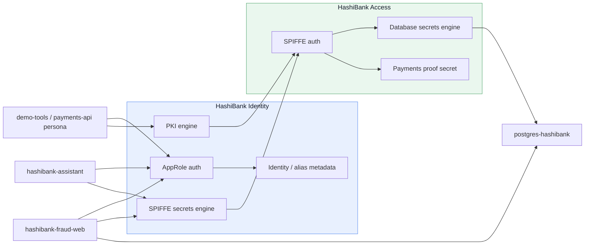
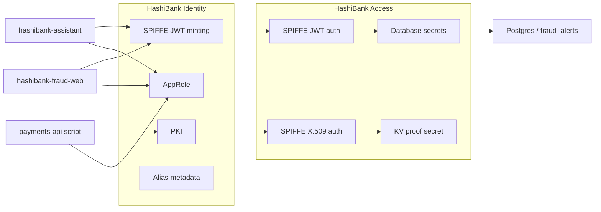
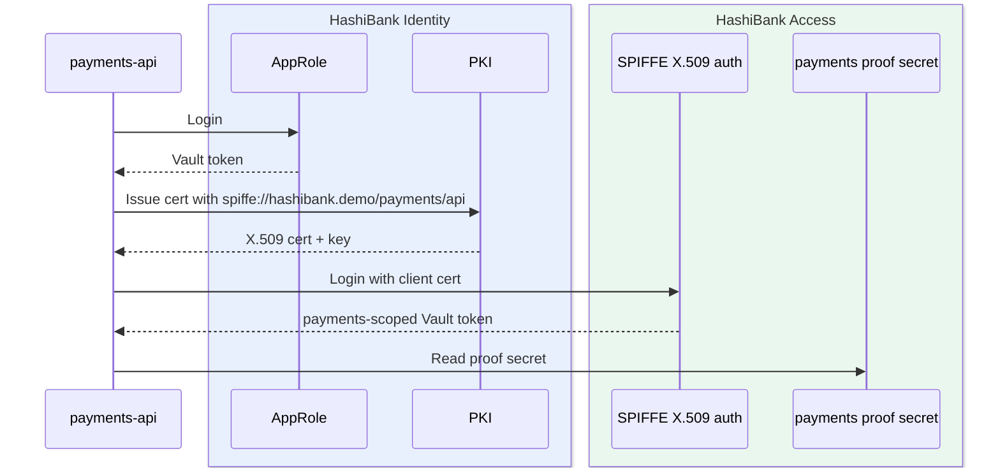
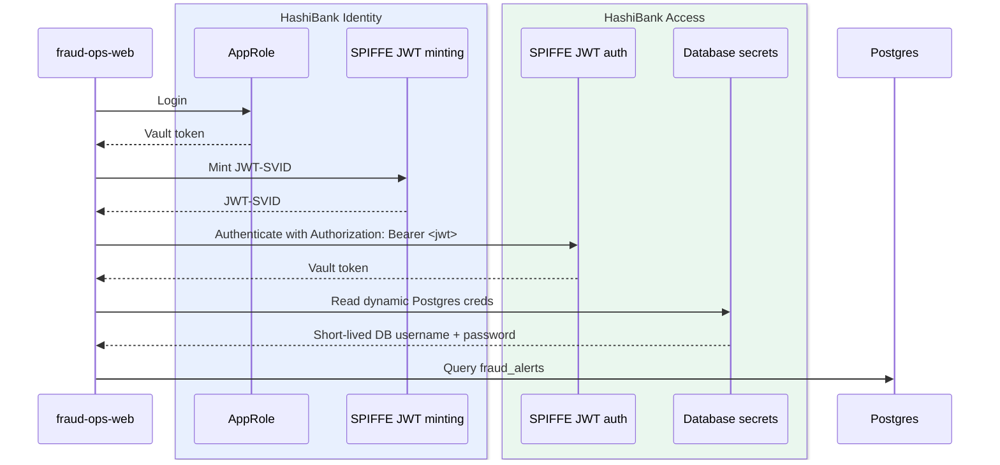
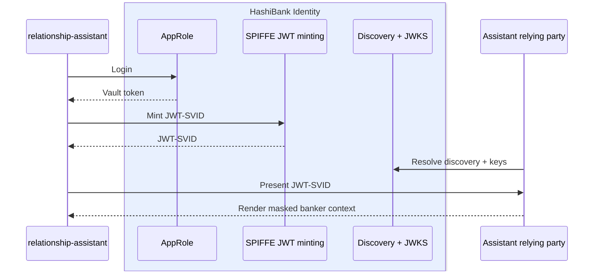

## SPIFFE-SPIRE

## Logical flow

## Slide 10 - HashiBank demo architecture

**Title:** Demo section: HashiBank architecture

**On-slide content**

- **Trust domain:** `hashibank.demo`
- **Identity plane:** `hashibank-identity`
- **Access plane:** `hashibank-access`

---

## Slide 11 - Demo 1: Payments API with X.509 SPIFFE auth

**Title:** Demo 1: `payments-api` gets policy through X.509 SPIFFE auth

**On-slide content**

---

## Slide 12 - Demo 2: Fraud Ops JWT-SVID to dynamic Postgres credentials

**Title:** Demo 2: `fraud-ops-web` turns JWT identity into live banking data

**On-slide content**

---

## Slide 13 - Demo 3: Relationship assistant with OIDC validation

**Title:** Demo 3: `relationship-assistant` validates a Vault-minted SPIFFE JWT outside Vault

**On-slide content**

