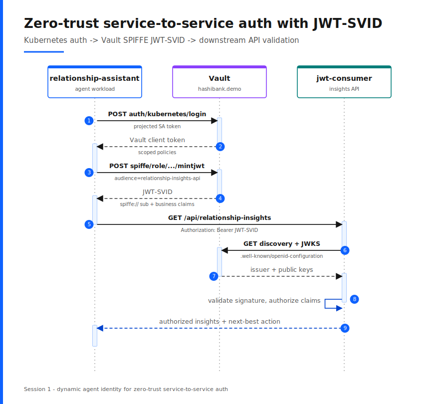

# Runbook: Your agents are looking SPIFFE - Dynamic Agent Identities

**Theme.** SPIFFE IDs and SVIDs uniquely identify AI agents and services, which enables secure service-to-service communication without static credentials. Vault establishes zero-trust identity for non-human actors and acts as both the identity issuer and the identity broker.

---

## Use case

Flow as dynamic agent identity for service-to-service authentication. The `relationship-assistant` workload is the "agentic." It authenticates with its platform-native Kubernetes identity, Vault mints a short-lived JWT-SVID with a unique `spiffe://` subject and business metadata, and a downstream API authorizes the call by validating that token through Vault's OIDC discovery and JWKS endpoints. No static credential is shared between the two services, and every call is attributable to a specific workload identity.

This is the cleanest way to show Vault as both the identity issuer (the SPIFFE secrets engine mints the JWT-SVID) and the trust anchor that downstream services validate against (discovery and JWKS), which is the core Vault+SPIFFE message.

## Demo recording

<!--
GitHub plays a video inline only when the file is uploaded as an attachment, not
when it is referenced by a committed relative path. To embed this recording:
  1. Open (or edit) a pull request or issue on this repository.
  2. Drag and drop `media/Vault-spiffe-identities-demo.mp4` into the comment box.
     GitHub uploads it and inserts a URL like
     https://github.com/user-attachments/assets/<uuid>.
  3. Copy that URL and replace the placeholder line below with it (URL on its own
     line). GitHub then renders an inline player.
The .mp4 is already H.264 / 1440p (GitHub's recommended codec) and ~8 MB, within
the 10 MB free-plan upload limit.
-->

<video src="https://github.com/user-attachments/assets/0aa80f19-0903-486a-b7bb-6fb2e82d760c" controls="controls" style="max-width: 100%;">
</video>

## Sequence diagram



---

## Demo: `demo-k8s-jwt.sh`

The demo is checkpointed and pauses after every call. The Kubernetes login and JWT mint run inside the actual `relationship-assistant` pod; discovery and the downstream API call show the validation path.

### Pre-flight

Run from the `demo/` directory.

```bash
# 1. Clean bootstrap (default Kubernetes-native path)
./scripts/teardown.sh
./scripts/bootstrap.sh

# 2. Smoke-test the full flow once, then reset so it is primed
./scripts/demo-k8s-jwt.sh run
./scripts/demo-k8s-jwt.sh reset
```

Optional pre-brief for a technical audience: `./scripts/bootstrap.sh review` pages through the Kubernetes auth roles, PKI roles, and the SPIFFE engine config.

### Live run

```bash
./scripts/demo-k8s-jwt.sh run
```

Press `Enter` to advance — the demo pauses after every call, not just between the four checkpoints below.

| Step | Checkpoint | What appears on screen | Talk track |
|------|-----------|------------------------|-------------|
| 1 | `kubernetes-login` | The assistant's Kubernetes auth role, its service account, and the Vault login response with a `client_token`. | "The agent authenticates with its Kubernetes service account token — its platform-native identity. No static secret. Vault hands back a short-lived token." |
| 2 | `mint-jwt` | The SPIFFE role template, then the minted JWT-SVID and its decoded claims: a `spiffe://hashibank.demo/ns/assistants/sa/relationship-assistant` subject plus `bank`, `application`, `line_of_business`, `environment`, and `customer_data_domain`. | "Vault mints a JWT-SVID for this exact workload. The subject is a portable SPIFFE ID, and we attach business context the downstream service can authorize on — not just 'who', but 'what kind of workload'." |
| 3 | `fetch-discovery` | Vault's OIDC discovery document and JWKS, with the issuer and `jwks_uri`. | "Any service can validate this token without calling Vault on the hot path. It reads the standard discovery document, fetches the public keys from JWKS, and verifies the signature locally." |
| 4 | `call-consumer` | The agent calls the `jwt-consumer` relationship insights API; the response shows `validated_claims`, masked relationship insights, and a next-best action. | "The downstream API validated the JWT-SVID, authorized the claims, and returned protected data. That is zero-trust service-to-service auth — the identity is useful because another service actually consumes and authorizes it, with no shared secret." |

### Backup plan

- If the live cluster misbehaves, walk the pre-captured transcript and checkpoint JSON saved in the session backup (`k8s-jwt.json` plus `jwt-demo.log`).
- `./scripts/demo-k8s-jwt.sh status` shows which checkpoints have completed.
- Each step can be replayed individually, for example `./scripts/demo-k8s-jwt.sh mint-jwt`.
- If a JWT expires while you linger, rerun `./scripts/demo-k8s-jwt.sh run`.
